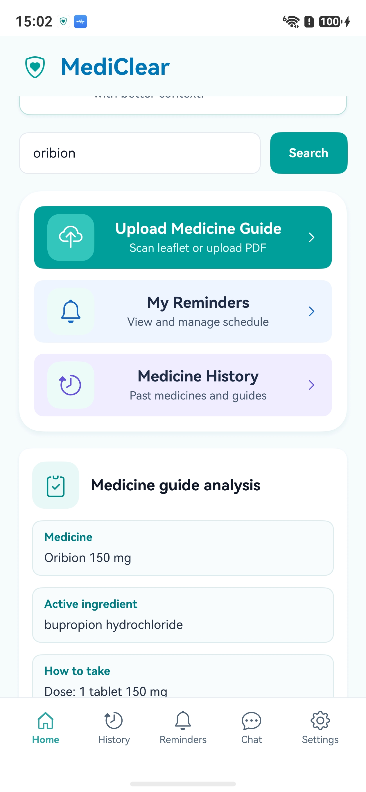
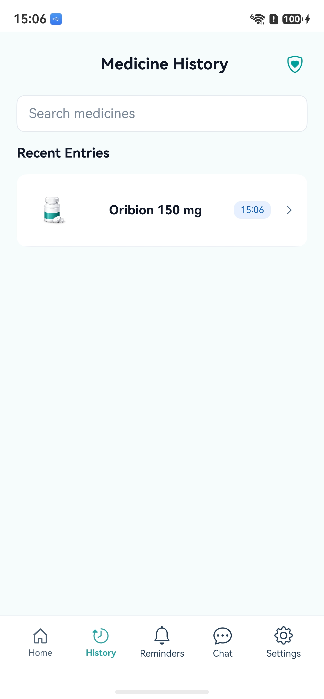
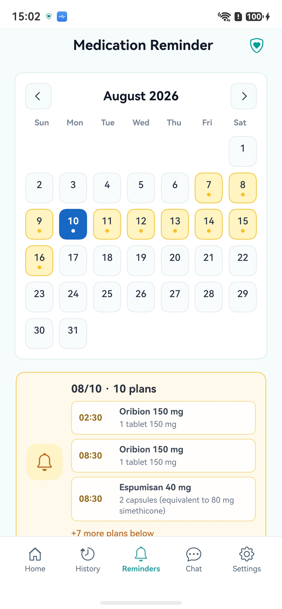
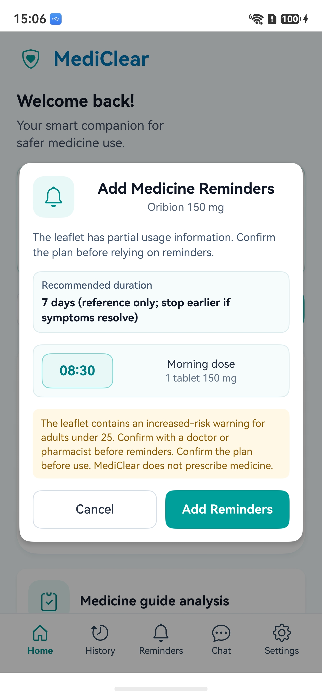
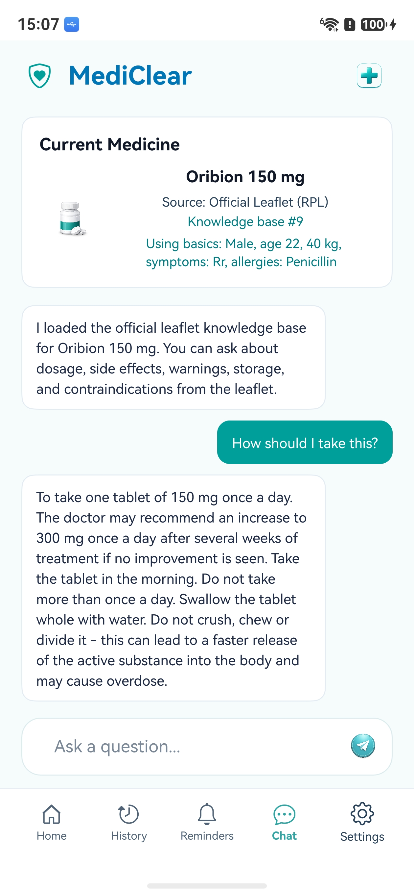
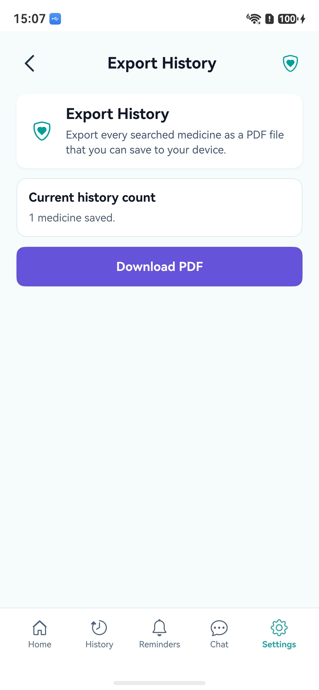
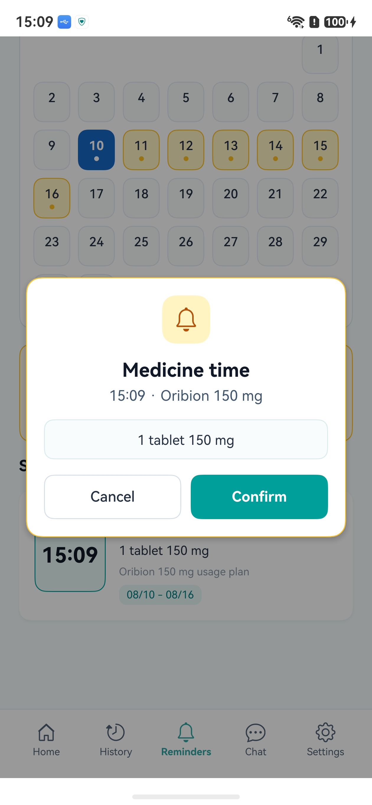
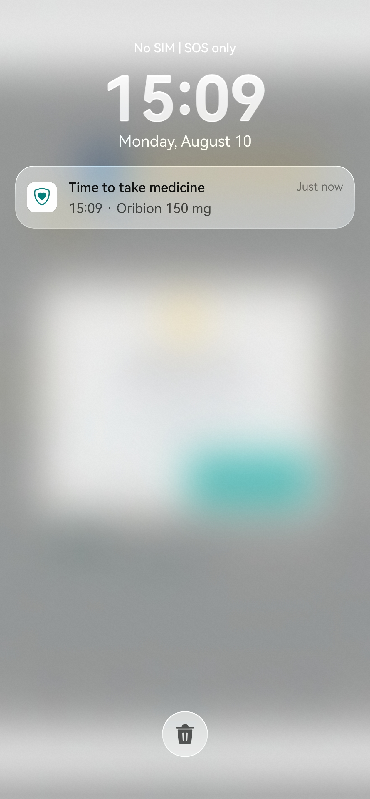

# MediClear

MediClear is a mobile AI medicine label assistant that turns complex over-the-counter medicine instructions into a clear dosage plan, safety checklist, and medication reminder schedule.

The app helps users understand official medicine labels, packages, leaflets, PDFs, and usage guides. It is designed to extract and organize information from medicine instructions, not to diagnose users or recommend what medicine they should take.

## Screenshots

| Home Search and Analysis | Medicine History | Reminder Summary |
| --- | --- | --- |
|  |  |  |

| Add Reminder Confirmation | Leaflet-Backed Chat | Export History |
| --- | --- | --- |
|  |  |  |

| Medicine-Time Dialog | System Notification |
| --- | --- |
|  |  |

## Deployment

MediClear uses a HarmonyOS / OpenHarmony ArkTS mobile app plus a Docker backend for official leaflet extraction, knowledge-base storage, chat answers, and reminder planning.

### 1. Start the Backend

Start the backend from the `backend` folder:

```bash
cd backend
docker compose up --build
```

Configure the backend LLM provider in `backend/.env`. The backend expects an OpenAI-compatible chat-completions endpoint, so it can use a local model, a self-hosted gateway, or a hosted provider.

Example for a local Ollama model exposed through an OpenAI-compatible endpoint:

```text
LLM_API_KEY=
LLM_BASE_URL=http://host.docker.internal:11434/v1
LLM_MODEL=llama3.2:3b
```

Example for a hosted OpenAI-compatible provider:

```text
LLM_API_KEY=your_api_key
LLM_BASE_URL=https://your-provider.example.com/v1
LLM_MODEL=your-model-name
```

Configure the mobile app backend URL in:

```text
entry/src/main/ets/services/BackendConfig.ets
```

For a physical phone, set the app backend URL to the computer's LAN address on the same Wi-Fi, for example `http://192.168.x.x:18080`. Windows Firewall or the host firewall must allow inbound traffic on port `18080`. Do not use `127.0.0.1` on a physical phone, because that points to the phone itself.

### 2. Install App Dependencies

Install ArkTS dependencies from the project root:

```bash
ohpm install --all
```

The Chat page uses `@luvi/lv-markdown-in` to render assistant answers that contain Markdown. If the dependency is missing, install it with:

```bash
ohpm install @luvi/lv-markdown-in
```

### 3. Build the App

Build the HarmonyOS / OpenHarmony app from the project root:

```bash
oniro-app build
```

The app can then be installed and launched through DevEco Studio or your normal HarmonyOS device workflow.

## Core Idea

Medicine labels and instruction leaflets are often long, technical, and difficult to follow. MediClear converts that information into a readable checklist that focuses on what users need most:

- What medicine this is
- What active ingredients it contains
- How much to take each time
- How often to take it
- Whether it should be taken before or after meals
- How long it should be used
- What warnings, contraindications, and side effects matter
- When reminders should be scheduled

Instead of answering "What medicine should I take?", MediClear answers:

"Based on the official label or leaflet you uploaded, here is how this medicine should be used, what to watch out for, and how reminders can be scheduled."

## Key Features

### Medicine Leaflet Parsing

Users can scan or upload:

- Medicine leaflet and instruction-guide photos
- Medicine labels
- PDF leaflets
- OTC medicine instruction sheets
- Doctor-provided usage guides

MediClear can extract:

- Medicine name
- Active ingredients
- Dosage
- Frequency
- When to take the medicine
- Usage duration
- Contraindications
- Side effects
- Storage requirements
- Expiration date
- Safety warnings

### Clear Usage Checklist

MediClear turns technical instructions into simple steps.

Example source instruction:

> Adults and children over 12 years: take 1 tablet every 6-8 hours. Do not exceed 3 tablets in 24 hours. Take after meals.

Generated checklist:

- Take 1 tablet each time.
- Take every 6-8 hours.
- Take after meals.
- Do not take more than 3 tablets in 24 hours.

### Medication Reminders

After the user confirms the extracted usage plan, MediClear can suggest reminder times.

Example:

- 08:30 after breakfast
- 19:30 after dinner

Reminder content may include:

- Medicine name
- Dose
- Timing note
- Daily limit warning

### Safety Checklist

MediClear extracts warnings and contraindications from official instructions and turns them into readable safety items.

Example:

- Avoid if allergic to this ingredient.
- Do not take with alcohol.
- Not suitable for children under 12 unless instructed by a doctor.
- Contact a doctor if symptoms continue for more than 3 days.

Each safety item should ideally be traceable to the original leaflet source, such as a warning section or line reference.

### Side Effect Summary

Side effects can be grouped by severity:

- Common side effects
- Serious warning signs
- Doctor-consultation warnings

The UI can visually separate these groups with different colors so users can quickly understand risk levels.

### Translation and Simplification

MediClear can support travelers, international students, and multilingual users by extracting medicine information from one language and presenting a simplified explanation in another language.

Example flow:

Polish medicine leaflet -> OCR -> English or Chinese simplified explanation -> dosage checklist -> reminder setup

This is more useful than word-by-word translation because it focuses on the information users actually need to follow the medicine instructions safely.

## App Flow

1. User opens MediClear.
2. User uploads a medicine leaflet, instruction-guide photo, dosage-label photo, or PDF.
3. OCR or PDF extraction reads the text.
4. The parser extracts medicine name, dosage, frequency, contraindications, side effects, expiration date, and storage requirements.
5. MediClear generates a "How to take" checklist.
6. MediClear generates safety warnings and contraindication notes.
7. User confirms the usage plan.
8. The app generates an in-app reminder schedule from the official leaflet dosage section and the user's saved basics.
9. User marks doses as taken, skipped, or edits the schedule.

## Main Screens

### Home

- Upload Medicine Guide
- Scan Medicine Label
- My Reminders
- Medicine History
- Recent Medicine

### Medicine Summary

- Medicine name
- OTC or medicine type
- Active ingredient
- How to take
- Reminder setup action

### Safety Checklist

- Do not use if
- Avoid
- Contact a doctor if
- Common side effects
- Serious warning signs

### Medication Reminder

- Scheduled dose times
- Dose details
- Mark as taken
- Skip
- Edit schedule
- Adherence tracking

### Medicine History

- Previously scanned medicines
- Saved guides
- Active, completed, or expired medicine records

### Profile

- Local privacy settings
- Reminder notification settings
- Language preference
- Data export

## Technical Direction

Possible implementation route:

1. OCR or PDF text extraction
2. Medicine instruction parser
3. Key information extraction
4. Dosage schedule generator
5. Contraindication and warning extractor
6. Reminder planner
7. ArkTS and ArkUI mobile interface
8. Local notification and history tracking

Possible components:

- OCR: HarmonyOS Core Vision text recognition for medicine leaflet and instruction-guide photos
- PDF parsing: PDF.js, Poppler, or platform PDF extraction
- Text extraction: rule-based parser plus optional LLM support
- Local database: SQLite
- Reminders: backend-generated in-app reminder schedule; system notification publishing is the next integration step
- UI: ArkTS and ArkUI
- Optional AI model: local model or self-hosted LLM

Chat answers can include concise Markdown such as bold labels, bullet lists, and numbered steps. The ArkUI chat page renders assistant replies with `@luvi/lv-markdown-in`, while user messages remain normal text bubbles.

### Text Extraction

Medicine leaflet photos and gallery images are recognized on-device with HarmonyOS Core Vision text recognition.

Official leaflet PDFs are not stored in the mobile app. After the app matches a medicine to an RPL product ID, the Docker backend downloads the official PDF, extracts text with `pdfjs-dist`, stores the resulting text chunks in MongoDB, and discards the PDF buffer.

### Reminder Planning

When the Home screen `Upload Medicine Guide` flow finishes, the app sends the matched backend document ID and the user's saved basics to:

```text
POST /api/reminders/plan
```

The backend reads the official leaflet `how_to_take` chunks, extracts dose, frequency, timing, duration, and basic age warnings, then returns a reminder plan. The mobile app applies that plan to the `Medication Reminder` page automatically. This flow is separate from the Chat page photo flow, which is used to load a medicine knowledge base for questions.

## Safety Boundary

MediClear does not diagnose diseases, prescribe medicine, recommend medicine, or replace doctors or pharmacists.

The app only helps users read, simplify, organize, and follow information from official medicine labels, packages, leaflets, and usage guides.

Users should always follow professional medical advice and consult a doctor or pharmacist when unsure, when symptoms persist, or when serious side effects occur.

## Current Status

This repository contains an ArkTS / ArkUI mobile UI prototype for MediClear, including:

- Home screen
- Medicine summary
- Safety checklist
- Medication reminders
- Medicine history
- Profile/settings page
- App name and app icon resources
